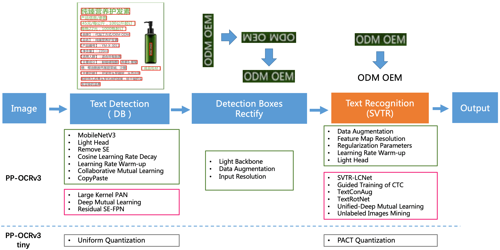
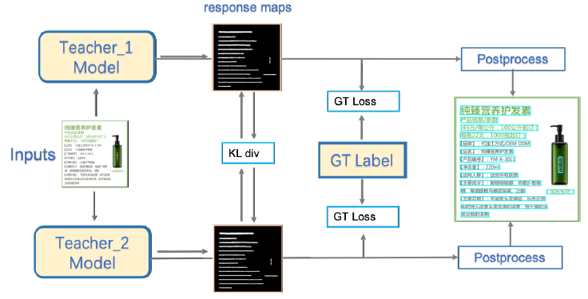
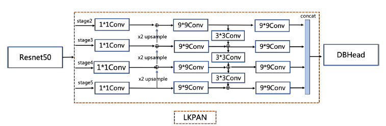
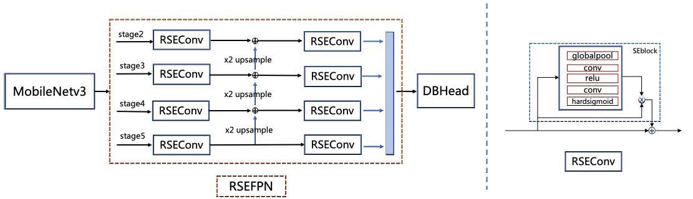
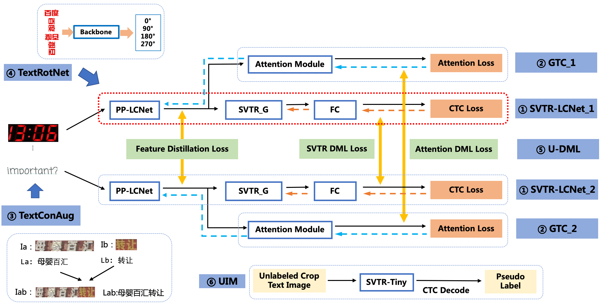
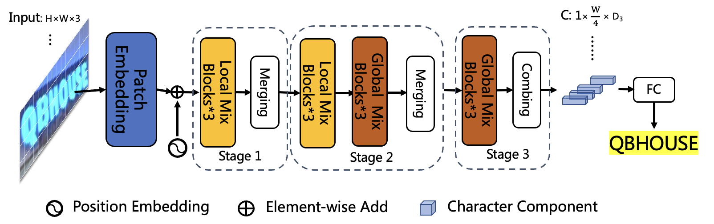
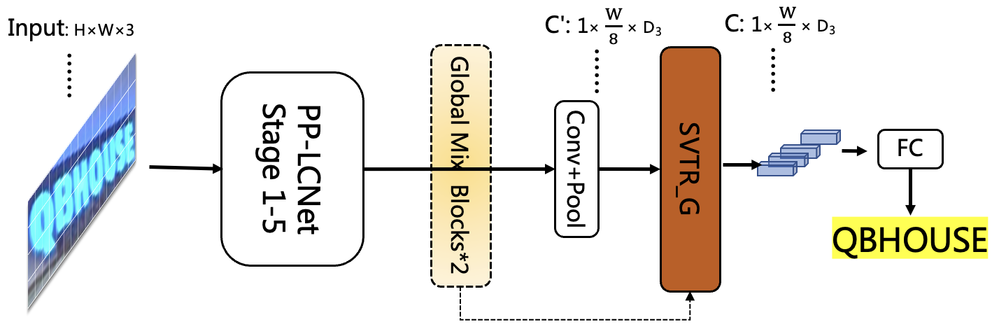

# PP-OCRv3 笔记
## 标题
 - PP-OCRv3: More Attempts for the Improvement of Ultra Lightweight OCR System
 - PP-OCRv3：改进超轻量级OCR系统的更多尝试

## 第一遍：带着问题去读
1. [x] 为什么叫超轻量？
2. [x] 做了更多的哪些尝试？
3. [x] 系统结构是什么样的？
4. [x] 论文目标是什么？
5. [x] 效果怎么样？
6. [x] 新的概念及描述？


## 简介
1. A4:设计一个实用的健壮的OCR系统，在准确性和效率之间平衡，解决v2中的单词漏检和识别错误
2. A2:9个方面：
   1. 检测模型：
      1. LK-PAN模块：大感受野
      2. RSE-FPN模块：残差注意力机制
      3. DML：蒸馏策略
   2. 识别模型：
      1. SVTR-LCNet：轻量级文本识别网络
      2. CTC：注意力引导的CTC
      3. TextConAug：数据增强
      4. TextRotNet：自监督学习提升预训练模型
      5. U-DML：加速模型
      6. UIM：提高效果
3. A5: Hmean提高5%

## 框架
A3：
1. 流程框架：

2. 检测训练框架：

CML蒸馏：合作蒸馏是师生蒸馏和学生互学的蒸馏策略结合
   1. 教师模型LK-PAN
      LK-PAN：将PAN的卷积从3x3变为9x9
      
   2. 学生模型RSE-FPN
      RSE-FPN：RSEConv替代FPN的卷积，作为SE模块的替代
       
教师有大视野，学生有残差注意力

3.识别模型框架

   1. SVTR 引入tranformer 不再涉及RNN
   
      1. 使用PP-LCNet前三段替换SVTR-Tiny前半部分
      2. 保留2个全局混合块
      3. 全局混合块后置于池化层以加速
   

A6:
- TextConAug: 
一种用于挖掘文本 背景信息的数据增强策。在一个批次中连接两张不同的图像以生成新图像，并进行自监督比较学习。可以丰富训练数据的背景信息并提高训练数据的多样性。

- TextRotNet: 
以自监督的方式使用大量未标记文本行数据进行训练。用该模型来初始化SVTR-LCNet 的权重，帮助文本识别模型更好地收敛。
**note:就是一边使用合成数据来初始化参数**
这个思想可以借鉴用来预训练表格模型

- U-DML: ~~Unified-Deep Mutual Learning U-DML是在PP-OCRv2中提出的一种策略，它非常有效地提高了准确性，而不增加模型的大小。~~

- UIM: Unlabeled Images Mining UIM是一种简单的无标签数据挖掘策略。其主要思想是利用高精度的文本识别模型预测无标签图像，获取伪标签，并选择预测置信度高的样本作为训练轻量化模型的训练数据。

## 实验

### 数据集
| 类型 | 训练集        | 验证集 | 测试集 |
|----|------------|-----|-----|
| 检测 | 68K+59K    |     |     |
| 识别 | 300W+1150W |     |     |

合成：UIM策略+PubTabNet裁剪+背景+旋转+透视+噪声

### 配置
- 优化器:Adam
- 学习率：0.001
- 规划器：
  - 余弦（检测）
    - 5e-5 权重衰减
  - 分段衰减（识别）
    - 3e-5 权重衰减
    - CTCHead 1e-5 权重衰减
  **think：如何在不同部分使用不同的权重衰减？**  
- epoch:
  - 检测 500 预热 2 每卡batch：8
  - 识别 800 预热 5，0.001x700+0.0001x100 每卡128
- 评估指标：
  - 检测：Hmean
  - 识别：句子准确率

### 实验
A5:
识别最好结果：Acc 79.4% 时间 7.6ms
系统结果：Hmean 62.9% CPU 331ms GPU 87ms size 15.6M


# 第二遍：对照源码去读

ToddleOCR中的V3检测配置源码：
```python
class Model(ConfigModel):
    debug = False
    use_gpu = True
    epoch_num = 500
    log_window_size = 20
    log_batch_step = 10
    model_dir = None
    save_epoch_step = 100
    eval_batch_step = [0, 400]
    meter_epoch_step = 0
    pretrained_model = None
    checkpoints = None

    distributed = False
    model_type = "det"
    algorithm = "DB"
    Transform = None
    Backbone = _(MobileNetV3, scale=0.5, model_name="large", disable_se=True)
    Neck = _(RSEFPN, out_channels=96, shortcut=True) # 同论文
    Head = _(DBHead, k=50)
    loss = DBLoss(
        balance_loss=True,
        main_loss_type="DiceLoss",
        alpha=5,
        beta=10,
        ohem_ratio=3,
    )
    metric = DetMetric(main_indicator="hmean")
    postprocessor = DBPostProcess(
        thresh=0.3, box_thresh=0.6, max_candidates=1000, unclip_ratio=1.5
    )
    Optimizer = _(Adam, betas=[0.9, 0.999], lr=0.001)
    LRScheduler = _(CosineAnnealingWarmRestarts, T_0=2)

    class Data:
        dataset = SimpleDataSet
        root = "train_data/icdar2015/text_localization/"
        label_file_list: "test_icdar2015_label.txt" = "train_icdar2015_label.txt"

    class Loader:
        shuffle: False = True
        drop_last = False
        batch_size: 1 = 8
        num_workers: 2 = 4

    Transforms = _[
        DecodeImage(imgs/img_mode="BGR", channel_first=False),
        DetLabelEncode() : ...,
        IaaAugment(
            augmenter_args=[
                {"type": "Fliplr", "args": {"p": 0.5}},
                {"type": "Affine", "args": {"rotate": [-10, 10]}},
                {"type": "Resize", "args": {"size": [0.5, 3]}},
            ]
        ) :,
        EastRandomCropData(size=[960, 960], max_tries=50, keep_ratio=True) :,
        MakeBorderMap(shrink_ratio=0.4, thresh_min=0.3, thresh_max=0.7) :,
        MakeShrinkMap(shrink_ratio=0.4, min_text_size=8) :,
        : DetResizeForTest() : ...,
        NormalizeImage(
            scale="1./255.",
            mean=[0.485, 0.456, 0.406],
            std=[0.229, 0.224, 0.225],
            order="hwc",
        ),
        ToCHWImage(),
        KeepKeys(
            "image",
            "threshold_map",
            "threshold_mask",
            "shrink_map",
            "shrink_mask",
        ) : KeepKeys("image", "shape", "polys", "ignore_tags") : KeepKeys(
            "image", "shape"
        ),
    ]
```
ToddleOCR中的V3识别配置源码：

```python
class Model(ConfigModel):
    model_type = "rec"
    algorithm = "SVTR"
    checkpoints = None
    distributed = False
    epoch_num = 500  # 论文中为 800
    eval_batch_step = [0, 2000]
    log_batch_step = 10
    log_window_size = 20
    max_text_length = 25
    meter_epoch_step = 1
    pretrained_model = None
    save_epoch_step = 3
    MAX_TEXT_LENGTH = 25
    USE_SPACE_CHAR = True
    model_dir = "./output/v3_en_mobile"

    use_gpu = False

    class Data:
        dataset = SimpleDataSet
        root = "train_data"
        label_files: ["train_data/train_list.txt"] = ["train_data/train_list.txt"]

    class Loader:
        shuffle: False = True
        batch_size: 1 = 128 # 同论文中128
        drop_last: True = True
        num_workers: 0 = 2
        pin_memory: False = True

    Transforms = _[
        DecodeImage(imgs/img_mode="BGR", channel_first=False),
        RecConAug(
            prob=0.5,
            ext_data_num=2,
            image_shape=[48, 320, 3],
            max_text_length=25,
        ) :, # 同论文 TextConAug
        RecAug(),
        MultiLabelEncode(MAX_TEXT_LENGTH, CHARACTER_DICT_PATH, USE_SPACE_CHAR) : ...,
        RecResizeImg(image_shape=[3, 48, 320]) : ... : RecResizeImg(
            image_shape=[3, 48, 320], infer_mode=True
        ), # 尺寸同论文
        KeepKeys(
            "image", "label_ctc", "label_sar", "length", "valid_ratio"
        ) : ... : KeepKeys("image"),
    ]
    Backbone = _(
        MobileNetV1Enhance,
        scale=0.5,
        last_conv_stride=[1, 2],
        last_pool_type="avg",
    )
    Neck = None
    postprocessor = CTCLabelDecode(CHARACTER_DICT_PATH, USE_SPACE_CHAR)
    Head = _(
        MultiHead,
        head_list=[
            {
                "class": "CTCHead",
                "Neck": {
                    "name": "svtr",
                    "dims": 64,
                    "depth": 2,
                    "hidden_dims": 120,
                    "use_guide": True,
                },
                "Head": {"fc_decay": 1e-05}, # 同论文中的衰减
            },
            {"class": "SARHead", "enc_dim": 512, "max_text_length": 25},
        ],
        out_channels_list={
            "CTCLabelDecode": len(postprocessor.character),
            "SARLabelDecode": len(postprocessor.character) + 2,
        },
    )
    loss = MultiLoss(loss_config_list=[{"CTCLoss": None}, {"SARLoss": None}])
    metric = RecMetric(main_indicator="acc", ignore_space=False)
    Optimizer = _(Adam, betas=[0.9, 0.999], lr=0.001)  # 优化器同论文
    LRScheduler = _(CosineAnnealingWarmRestarts, T_0=5) # 识别是余弦，不同于论文
```

TextConAug 代码如下:
```python
class RecConAug:
    def __init__(
        self,
        prob=0.5,
        image_shape=(32, 320, 3),
        max_text_length=25,
        ext_data_num=1,
        **kwargs
    ):
        self.ext_data_num = ext_data_num
        self.prob = prob
        self.max_text_length = max_text_length
        self.image_shape = image_shape
        self.max_wh_ratio = self.image_shape[1] / self.image_shape[0]

    def merge_ext_data(self, data, ext_data):
        ori_w = round(
            data["image"].shape[1] / data["image"].shape[0] * self.image_shape[0]
        )
        ext_w = round(
            ext_data["image"].shape[1]
            / ext_data["image"].shape[0]
            * self.image_shape[0]
        )
        data["image"] = cv2.resize(data["image"], (ori_w, self.image_shape[0]))
        ext_data["image"] = cv2.resize(ext_data["image"], (ext_w, self.image_shape[0]))
        data["image"] = np.concatenate([data["image"], ext_data["image"]], axis=1)
        data["label"] += ext_data["label"]
        return data

    def __call__(self, data):
        rnd_num = random.random()
        if rnd_num > self.prob:
            return data
        for idx, ext_data in enumerate(data["ext_data"]):
            if len(data["label"]) + len(ext_data["label"]) > self.max_text_length:
                break
            concat_ratio = (
                data["image"].shape[1] / data["image"].shape[0]
                + ext_data["image"].shape[1] / ext_data["image"].shape[0]
            )
            if concat_ratio > self.max_wh_ratio:
                break
            data = self.merge_ext_data(data, ext_data)
        data.pop("ext_data")
        return data
```

## 遗留问题
1. [] 进一步去读 SVTR 论文
2. [] 进一步去读 DB++ 论文
